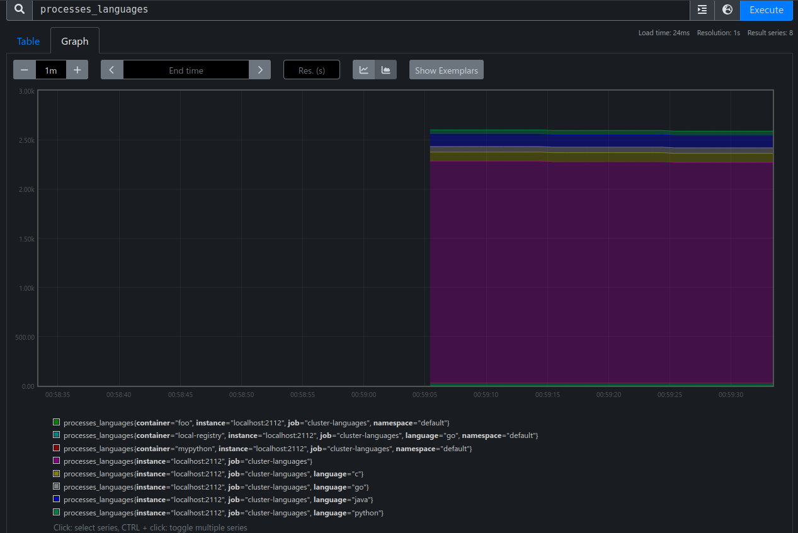
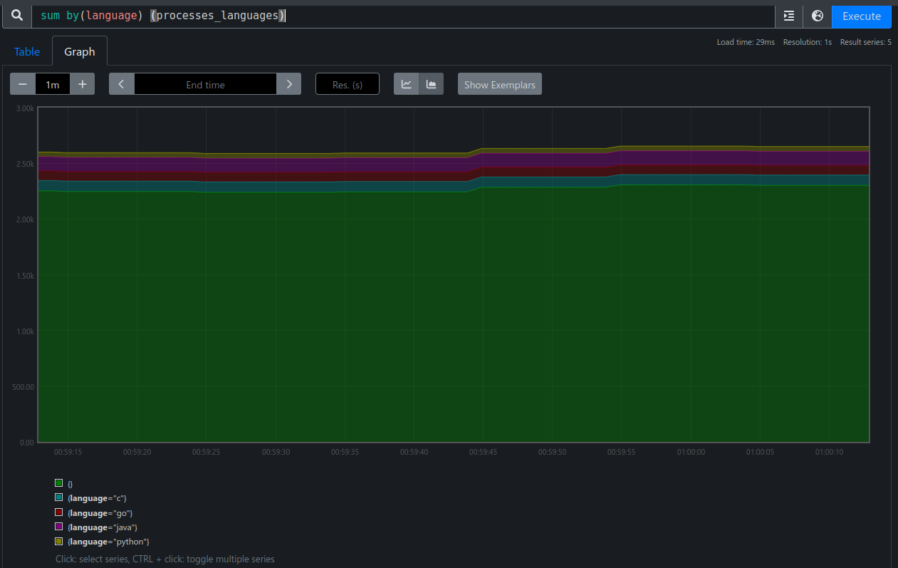

Cluster Languages

This example uses the snapshot process gadget to provide prometheus metrics on the programming languages used in the cluster.

## How to use?

```bash
# Compile
$ go build .

# Run with root permissions
sudo ./cluster-languages
```

Metrics are available on port 2222

```bash
$ curl http://localhost:2112/metrics
# HELP processes_languages Programming language of different processes.
# TYPE processes_languages gauge
processes_languages{container="",language="",namespace=""} 2244
processes_languages{container="",language="c",namespace=""} 93
processes_languages{container="",language="go",namespace=""} 59
processes_languages{container="",language="java",namespace=""} 126
processes_languages{container="",language="python",namespace=""} 43
processes_languages{container="foo",language="",namespace="default"} 1
processes_languages{container="local-registry",language="go",namespace="default"} 29
processes_languages{container="mypython",language="",namespace="default"} 1
# HELP promhttp_metric_handler_errors_total Total number of internal errors encountered by the promhttp metric handler.
# TYPE promhttp_metric_handler_errors_total counter
promhttp_metric_handler_errors_total{cause="encoding"} 0
promhttp_metric_handler_errors_total{cause="gathering"} 0
```

### With Prometheus

Add the folling scrape config to your configuration file:

```yaml
scrape_configs:
- job_name: myapp
  scrape_interval: 10s
  static_configs:
  - targets:
    - localhost:2112
```

Then, you'll have the `processes_languages` metric available:




### Cardinality

This example uses `namespace`, `container` & `language` as labels. Other Kubernetes fields aren't supported: See https://github.com/inspektor-gadget/inspektor-gadget/issues/737.
